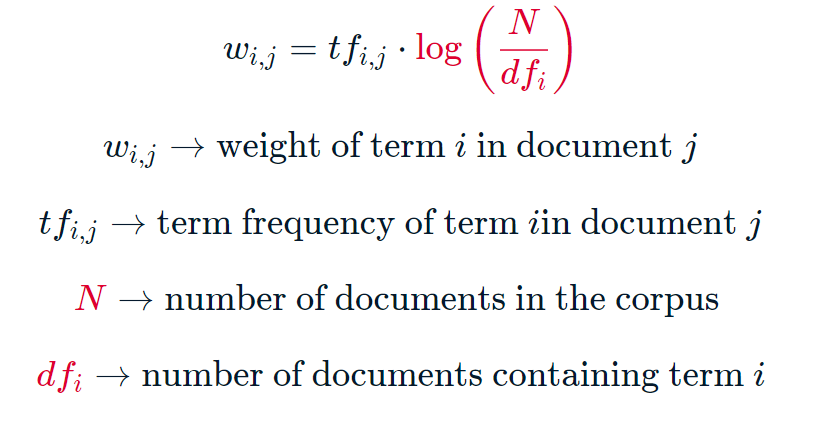

```{r setup, include=FALSE}
knitr::opts_chunk$set(echo = T,
                      results = "hide")
```

## Term frequency-inverse document frequency (TD-IDF)

TD-IDF baseia-se na ideia de que o peso de um termo em um documento deve ser proporcional à sua frequência e função inversa do número de documentos em que ocorre.

Matematicamente, temos:



Portanto, digamos que a palavra 'biblioteca' apareça em um documento 5 vezes. Há 20 documentos no corpus e 'biblioteca' aparece em 8 deles. Então, o peso tf-idf dessa palavra na representação vetorial deste documento será 5*log(20/8) que é aproximadamente 4. 

> Em geral, quanto maior o peso tf-idf, mais importante é a palavra na caracterização do documento. 

Um peso tf-idf alto para uma palavra em um documento pode implicar que a palavra é relativamente **exclusiva** desse documento específico. Uma palvra que aparece muitas vezes em um documento e raras vezes em outros documentos deve receber um peso maior em relação a uma outra palavra que aparece muitas vezes em todos os documentos, pois **caracteriza** o documento.

\color{blue} O que acontece com uma palavra que aparece n vezes em documento, ma também está presente em todos os outros documentos? \color{black} Na verdade, o peso tf-idf para essa palavra em cada documento será 0. Isso ocorre porque a frequência inversa do documento é constante em todos os documentos em um corpus e, como a palavra ocorre em todos os documentos, seu valor é log(1), que é 0.

## Vetores tf-idf para palestras TED


Vamos utilizar um corpus ted que contém as transcrições de 500 TED Talks. A tarefa é gerar os vetores tf-idf para essas palestras.


```{python echo = T, results = 'hide'}
# Import TfidfVectorizer
# from sklearn.feature_extraction.text import TfidfVectorizer
# 
# # Create TfidfVectorizer object
# vectorizer = TfidfVectorizer()
# 
# # Generate matrix of word vectors
# tfidf_matrix = vectorizer.fit_transform(ted)
# 
# # Print the shape of tfidf_matrix
# print(tfidf_matrix.shape)
```

## Cosine similarity

Agora sabemos como calcular vetores de documentos de texto. Com essa representação em mente, vamos agora explorar técnicas que nos permitirão determinar quão semelhantes dois vetores e consequentemente dois documentos são entre si. Mais especificamente, aprenderemos sobre *the cosine similarity score*, que é uma das métricas de similaridade mais popularmente usadas em NLP. 

Simplificando, o score ou a pontuação de similaridade do cosseno de dois vetores é o cosseno do ângulo entre os vetores. Matematicamente, é a razão entre o produto escalar dos vetores e o produto da magnitude dos dois vetores.


