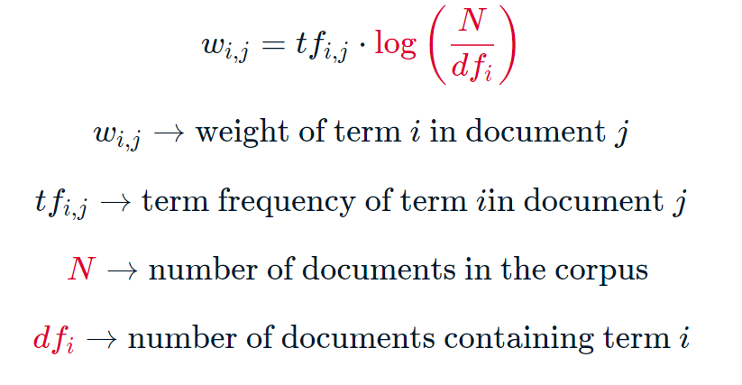
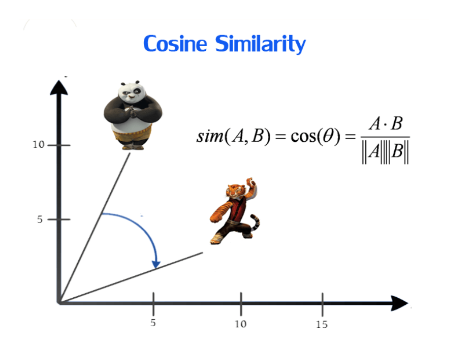
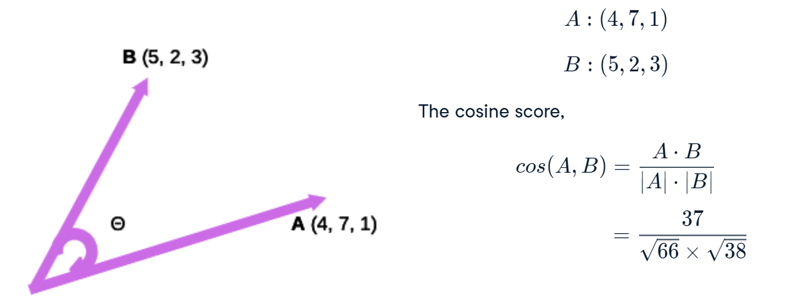

README
================

## Term frequency-inverse document frequency (TF-IDF)

TF-IDF baseia-se na ideia de que o peso de um termo em um documento deve
ser proporcional à sua frequência e função inversa do número de
documentos em que ocorre.

Matematicamente, temos:



Portanto, digamos que a palavra ‘biblioteca’ apareça em um documento 5
vezes. Há 20 documentos no corpus e ‘biblioteca’ aparece em 8 deles.
Então, o peso tf-idf dessa palavra na representação vetorial deste
documento será 5\*log(20/8) que é aproximadamente 4.

> Em geral, quanto maior o peso tf-idf, mais importante é a palavra na
> caracterização do documento.

Um peso tf-idf alto para uma palavra em um documento pode implicar que a
palavra é relativamente **exclusiva** desse documento específico. Uma
palvra que aparece muitas vezes em um documento e raras vezes em outros
documentos deve receber um peso maior em relação a uma outra palavra que
aparece muitas vezes em todos os documentos, pois **caracteriza** o
documento.

O que acontece com uma palavra que aparece n vezes em documento, ma
também está presente em todos os outros documentos? Na verdade, o peso
tf-idf para essa palavra em cada documento será 0. Isso ocorre porque a
frequência inversa do documento é constante em todos os documentos em um
corpus e, como a palavra ocorre em todos os documentos, seu valor é
log(1), que é 0.

## Vetores tf-idf para palestras TED

Vamos utilizar um corpus ted que contém as transcrições de 500 TED
Talks. A tarefa é gerar os vetores tf-idf para essas palestras.

``` python
# Import TfidfVectorizer
# from sklearn.feature_extraction.text import TfidfVectorizer
# 
# # Create TfidfVectorizer object
# vectorizer = TfidfVectorizer()
# 
# # Generate matrix of word vectors
# tfidf_matrix = vectorizer.fit_transform(ted)
# 
# # Print the shape of tfidf_matrix
# print(tfidf_matrix.shape)
```

## Cosine similarity

Agora sabemos como calcular vetores de documentos de texto. Com essa
representação em mente, vamos agora explorar técnicas que nos permitirão
determinar quão semelhantes dois vetores e consequentemente dois
documentos são entre si. Mais especificamente, aprenderemos sobre *the
cosine similarity score*, que é uma das métricas de similaridade mais
popularmente usadas em NLP.

Simplificando, o score ou a pontuação de similaridade do cosseno de dois
vetores é o cosseno do ângulo entre os vetores. Matematicamente, é a
razão entre o produto escalar (*dot product*) dos vetores e o produto da magnitude dos
dois vetores.

 A magnitude de um vetor é essencialmente o comprimento
do vetor. Matematicamente, é definido como a raiz quadrada da soma dos
quadrados dos valores em todas as dimensões de um vetor.

Sejam dois vetories A e B, em que A:(4,7,1) e B:(5,2,3). Então, o
produto escalar dos vetores será dado por

e o produto da magnitude dos dois vetores será dado por




Como a pontuação do cosseno é simplesmente o cosseno do ângulo entre
dois vetores, seu valor é limitado entre -1 e 1. No entanto, em NLP, os
vetores de documento quase sempre usam pesos não negativos. Portanto, as
pontuações de cosseno variam entre 0 e 1, onde 0 indica nenhuma
semelhança e 1 indica que os documentos são idênticos.

> Em NLP, the cosine score varia entre 0 e 1, onde 0 indica nenhuma
> semelhança e 1 indica que os documentos são idênticos.

## Implementação utilizando o scikit-learn

``` python
# Import the cosine_similarity
from sklearn.metrics.pairwise import cosine_similarity

# Define two 3-dimensional vectors A and B
A = (4,7,1)
B = (5,2,3)

# Compute the cosine score of A and B
score = cosine_similarity([A],[B])

# Print the cosine score
print(score)
```
 
## Construindo um recomendador de filmes

Utilizaremos vetores tf-idf e pontuações de cosseno para construir um sistema de recomendação que sugere filmes com base na similaridade de enredos. Nossa tarefa é construir um sistema que receba o título de um filme e produza uma lista de filmes com enredos semelhantes. Por exemplo, se utilizarmos o filme 'O Poderoso Chefão', poderíamos esperar filmes listados que têm a ver com crime e gângsteres.

## Etapas

1. Pré-processamento de texto
2. Gerar vetores tf-idf
3. Gerar matriz de similaridade de cosseno
4. Construir uma função de recomendação

A função de recomendação possui 03 argumentos: o título do filme, a matriz de similaridade de cosseno e uma série de índices. A função extrai as pontuações de semelhança de cosseno par a par de um filme com todos os outros filmes do dataset. Em seguida, ela classifica essas pontuações em ordem decrescente. Finalmente, ela produz os títulos dos filmes correspondentes às pontuações mais altas de similaridade. Observe que a função ignora a pontuação de similaridade mais alta (score = 1). Isso ocorre porque o filme mais semelhante a um determinado filme é o próprio filme!

**Uma dica é substituir a função cosine_similarity por linear_kernel. A saída permanece a mesma, mas leva muito menos tempo para calcular.** A diferença no tempo de execução entre as duas funções foi pequena (0.357 v. 0.339 seconds), porém quando se está trabalhando com um grande volume de dados e seus vetores estão na representação tf-idf, é uma boa prática utilizar linear_kernel para obter um melhor desempenho.


